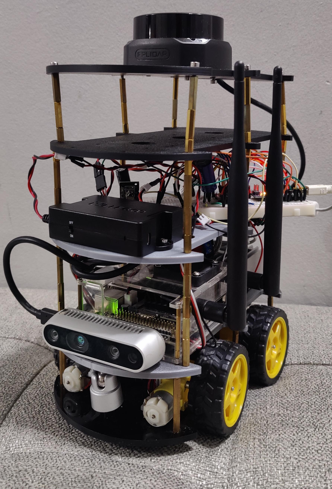
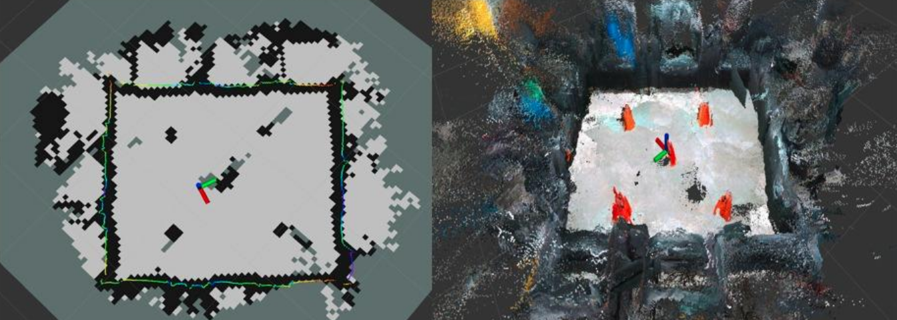

# ROS-Based Indoor Mobile Robot for SLAM and Autonomous Navigation

A low-cost ROS-based mobile robot capable of autonomous exploration, 2D/3D SLAM, localization, point-to-point navigation, and obstacle avoidance.

Built as a University of Windsor ELEC-4000 Capstone Design Project using a modified Elegoo Smart Robot Car V4, Jetson Nano, Intel RealSense D435, RPLIDAR S2, wheel encoders, an ICM-20948 IMU, and ROS Melodic.

<p align="center">
  
</p>

The final prototype demonstrated:

* 2D occupancy-grid mapping
* RGB-D 3D reconstruction
* RTAB-Map loop closure
* Saved-map localization
* Point-to-point autonomous navigation
* Frontier-based autonomous exploration

---

## Demo

### Autonomous Exploration

<p align="center">
  
</p>

The rover uses Explore Lite to detect frontiers between known and unknown regions of the map and automatically sends navigation goals to `move_base`. As the robot explores, RTAB-Map continuously expands the occupancy grid and RGB-D reconstruction.

---

### Point-to-Point Navigation

<p align="center">
  
</p>

A previously generated RTAB-Map database can be loaded for localization. A destination is then selected in RViz and the robot plans and follows a path toward the goal while accounting for nearby obstacles.

---

## Mapping Results

Representative real-world mapping results from an approximately **4–5 m × 4–5 m** indoor test environment:

<p align="center">
  
</p>

The left side shows the generated 2D occupancy grid and robot trajectory, while the right side shows the corresponding RGB-D 3D reconstruction.

Mapping was performed autonomously using Explore Lite, with representative runs lasting roughly five minutes. RTAB-Map loop closure was achieved, and the resulting database was saved and later reused for localization and navigation.

---

## System Architecture

<p align="center">
  
</p>

The system is divided between high-level autonomy on the Jetson Nano and low-level sensing and motor control on the Arduino Nano.

### High-level autonomy

The Jetson Nano runs ROS Melodic and handles:

* RTAB-Map SLAM
* `robot_localization` EKF
* `move_base`
* Explore Lite
* RealSense D435 input
* RPLIDAR S2 input
* ROS-to-Arduino serial communication

A laptop running a matching ROS environment is used for development, RViz visualization, monitoring, and teleoperation.

### Low-level control

The Arduino Nano handles:

* Wheel encoder acquisition
* ICM-20948 IMU acquisition
* Motor commands
* TB6612FNG control
* Bidirectional serial communication with the Jetson

The four drive motors are controlled as **left and right motor pairs**, producing differential/skid-steer-style motion.

---

## Hardware Architecture

<p align="center">
  
</p>

| Component                 | Role                                     |
| ------------------------- | ---------------------------------------- |
| Elegoo Smart Robot Car V4 | Mobile base and drivetrain               |
| Jetson Nano               | ROS, SLAM, localization and navigation   |
| Arduino Nano              | Embedded motor and sensor interface      |
| TB6612FNG                 | Dual H-bridge motor driver               |
| 4× wheel encoders         | Wheel displacement measurements          |
| ICM-20948                 | Gyroscope and accelerometer measurements |
| Intel RealSense D435      | RGB-D sensing                            |
| RPLIDAR S2                | 2D laser scanning and obstacle detection |
| Powered USB hub           | Stable RealSense + RPLIDAR connectivity  |
| LiPo supply + regulation  | Jetson and sensor-side power             |
| Separate motor battery    | Drivetrain power                         |
| Custom 3D-printed plates  | Electronics and sensor mounting          |

The robot was heavily modified from the original Elegoo platform. The stock ultrasonic sensor, camera module, and control shield were removed, and four custom 3D-printed mounting plates were developed to support the added sensing, compute, power, and control hardware.

---

## ROS Data Flow

### Navigation commands

```text
move_base / Explore Lite
        ↓
   /cmd_vel_nav
        ↓
 cmd_vel_deadband
        ↓
     /cmd_vel
        ↓
cmdvel_to_arduino
        ↓
    USB serial
        ↓
   Arduino Nano
        ↓
    TB6612FNG
        ↓
      Motors
```

### State estimation

```text
Wheel encoders ─┐
                ├──> Arduino Nano ──> Jetson serial bridge
ICM-20948 ──────┘                         │
                                         ├──> /wheel_odom
                                         └──> /imu/data
                                                  ↓
                                         robot_localization
                                                  ↓
                                        /odometry/filtered
                                                  ↓
                                         RTAB-Map / move_base
```

RTAB-Map provides the `map → odom` transform, while the EKF provides `odom → base_link`.

---

## Software Stack

* ROS Melodic
* RTAB-Map
* move_base
* Explore Lite
* robot_localization
* imu_filter_madgwick
* Intel RealSense ROS
* rplidar_ros
* RViz
* Gazebo
* PlatformIO
* Docker

---

## Repository Structure

```text
firmware-pio/
└── Arduino Nano firmware
    ├── motor control
    ├── encoder odometry
    └── IMU support

ros-for-laptop/
└── Laptop ROS/Docker environment

ros-for-jetson/
└── Jetson ROS/Docker environment

slam_ws/
└── catkin workspace
    └── src/
        ├── robot_description/
        │   ├── URDF
        │   ├── launch files
        │   ├── navigation configs
        │   └── cmd_vel_deadband
        │
        └── jetson_arduino_bridge/
            └── ROS ↔ Arduino serial bridge
```

---

## Quick Start

### Build the Arduino firmware

```bash
cd firmware-pio
pio run
pio run -t upload
```

### Build the ROS workspace

```bash
cd slam_ws
catkin_make
source devel/setup.bash
```

### Mapping + Autonomous Exploration

```bash
roslaunch robot_description explore_mapping.launch \
  use_explore_lite:=true
```

### Saved-Map Point-to-Point Navigation

```bash
roslaunch robot_description saved_map_nav.launch
```

Navigation goals can then be selected using 2D Nav Goal in RViz.

---

## Motion Tuning

The physical drivetrain has a significant motor deadband, so planner output cannot be passed directly to the motors.

A custom `cmd_vel_deadband` node maps ROS velocity commands into usable motor commands.

It also supports pulsed in-place turns. Continuous fast rotation frequently caused RGB-D map smearing, so turning can instead be performed in short bursts with brief stationary periods between them.

This improved RTAB-Map performance during autonomous exploration.

---

## Simulation

<p align="center">
  
</p>

Simulation was used before full hardware deployment to validate:

* SLAM
* TF relationships
* Saved-map localization
* Costmaps
* Point-to-point navigation
* Autonomous exploration
* Custom robot motion

Development initially used a known reference robot before moving toward a custom Gazebo model representing the physical rover.

---

## Known Limitations

The final system is a research/educational prototype rather than a production-ready autonomous robot.

Some remaining limitations include:

* Mapping quality degrades during aggressive motion.
* RGB-D mapping performs best in well-lit environments.
* Ghost obstacles can occasionally affect path planning.
* Autonomous exploration is functional but not perfectly repeatable.
* Point-to-point navigation depends strongly on map and localization quality.
* Dynamic obstacle response is relatively slow.
* Testing was limited to slow indoor operation.

---

## Authors

**Team 56 — ELEC-4000 Capstone Design Project**

**Ahmed Anwer**

**Ammaar Najeeb Ahmed**

Faculty Advisor: **Dr. Ning Zhang**

Department of Electrical and Computer Engineering
University of Windsor
