# ROS 2 Simulation — SLAM, Navigation, and Autonomous Exploration

This directory contains the ROS 2 simulation developed for the Team 56 autonomous indoor mobile robot capstone project.

The simulation was used to develop and validate the robot's localization, mapping, point-to-point navigation, and autonomous exploration pipeline before and alongside physical-hardware testing.

## Simulation Stack

- Ubuntu Linux
- ROS 2 Jazzy
- Gazebo Harmonic
- RTAB-Map
- Nav2
- Explore Lite
- robot_localization EKF
- RViz
- 2D LiDAR
- RGB-D camera
- IMU
- Wheel odometry / simulated odometry

## Main Capabilities

The simulation supports:

- Custom Elegoo mobile-robot model
- Custom two-room Gazebo environment
- LiDAR, RGB-D camera, and IMU simulation
- EKF-based odometry filtering
- RTAB-Map SLAM
- TF integration
- Nav2 point-to-point navigation
- Local and global costmaps
- DWB local planning
- Autonomous frontier exploration using Explore Lite

## Directory Structure

    simulation/
    ├── config/
    │   ├── ekf.yaml
    │   ├── elegoo_nav2_params.yaml
    │   ├── elegoo_nav_to_pose.xml
    │   └── elegoo_explore.yaml
    │
    ├── launch/
    │   └── navigation_no_docking_launch.py
    │
    ├── ros2_ws/
    │   └── src/
    │       └── elegoo_description/
    │
    ├── worlds/
    │   └── two_room_world.sdf
    │
    ├── images/
    └── docs/

## Simulation Pipeline

The main autonomy pipeline is:

Gazebo sensors → ROS 2 bridge → EKF filtered odometry → RTAB-Map → Nav2 → Explore Lite

RTAB-Map provides the SLAM map and localization frame used by the navigation stack.

Nav2 uses the map, filtered odometry, LiDAR data, and TF tree to perform point-to-point navigation.

Explore Lite uses the generated occupancy map to identify frontier regions and request navigation goals for autonomous exploration.

## Typical Launch Sequence

### 1. Start Gazebo

    source /opt/ros/jazzy/setup.bash
    source ~/ros2_ws/install/setup.bash

    gz sim ~/ros2_ws/src/elegoo_robot/worlds/two_room_world.sdf

### 2. Generate and Spawn the Robot

    source /opt/ros/jazzy/setup.bash
    source ~/ros2_ws/install/setup.bash

    cd ~/ros2_ws

    ros2 run xacro xacro \
      src/elegoo_description/urdf/elegoo_robot.urdf.xacro \
      > /tmp/elegoo_robot.urdf

    check_urdf /tmp/elegoo_robot.urdf

    ros2 run ros_gz_sim create \
      -file /tmp/elegoo_robot.urdf \
      -name elegoo_robot \
      -x -2.0 \
      -y 0.5 \
      -z 0.045
### 3. Start Robot State Publisher

    ros2 run robot_state_publisher robot_state_publisher \
      /tmp/elegoo_robot.urdf \
      --ros-args \
      -p use_sim_time:=true

### 4. Start Joint State Publisher

    ros2 run joint_state_publisher_gui joint_state_publisher_gui \
      --ros-args \
      -p use_sim_time:=true

### 5. Start Gazebo-to-ROS Bridges

Bridge the following simulation interfaces:

- `/cmd_vel`
- `/odom`
- `/scan`
- `/imu`
- RGB camera
- Depth camera
- Camera info
- Point cloud
- `/clock`

### 6. Start EKF

    ros2 run robot_localization ekf_node \
      --ros-args \
      --params-file ~/ros2_ws/config/ekf.yaml

### 7. Start RTAB-Map SLAM
RTAB-Map uses:

- `base_link`
- `/odometry/filtered`
- RGB image
- depth image
- camera calibration
- `/scan`

The validated setup uses 3-DoF motion constraints and combines visual/depth sensing with LiDAR and filtered odometry.

### 8. Manual Mapping

Manual teleoperation can be used to create and validate the map before autonomous navigation:

    ros2 run teleop_twist_keyboard teleop_twist_keyboard

### 9. Start Nav2

    ros2 launch navigation_no_docking_launch.py \
      use_sim_time:=true \
      params_file:=simulation/config/elegoo_nav2_params.yaml

A small nearby navigation goal should be tested before autonomous exploration.

### 10. Start Explore Lite

    ros2 run explore_lite explore \
      --ros-args \
      --params-file simulation/config/elegoo_explore.yaml

Explore Lite detects map frontiers and sends navigation goals to Nav2 until the reachable environment has been explored.

## Validation

The simulation was used to validate:

1. SLAM map generation.
2. EKF-based pose estimation.
3. TF consistency between `map`, `odom`, and `base_link`.
4. Obstacle detection through the LiDAR scan.
5. Nav2 global and local planning.
6. Point-to-point autonomous navigation.
7. Obstacle-aware replanning.
8. Autonomous frontier exploration.

## Notes

The simulation configuration in this directory represents the navigation and exploration portion of the original Team 56 capstone.

Later semantic-mapping work using YOLOv8 was developed separately and is intentionally not included here.

## Simulation Results

### Gazebo Environment

The custom Elegoo robot was simulated in a two-room Gazebo environment for SLAM, navigation, and autonomous exploration testing.

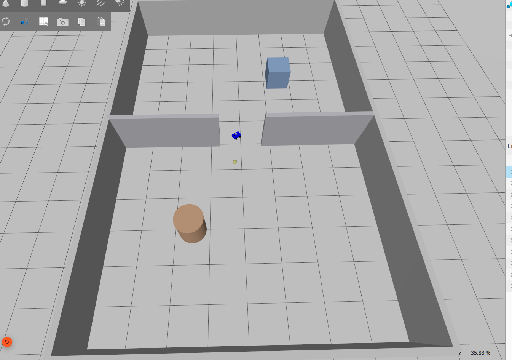

### RTAB-Map SLAM

RTAB-Map was used to generate the occupancy map while combining filtered odometry, LiDAR, RGB-D sensing, and the robot TF tree.

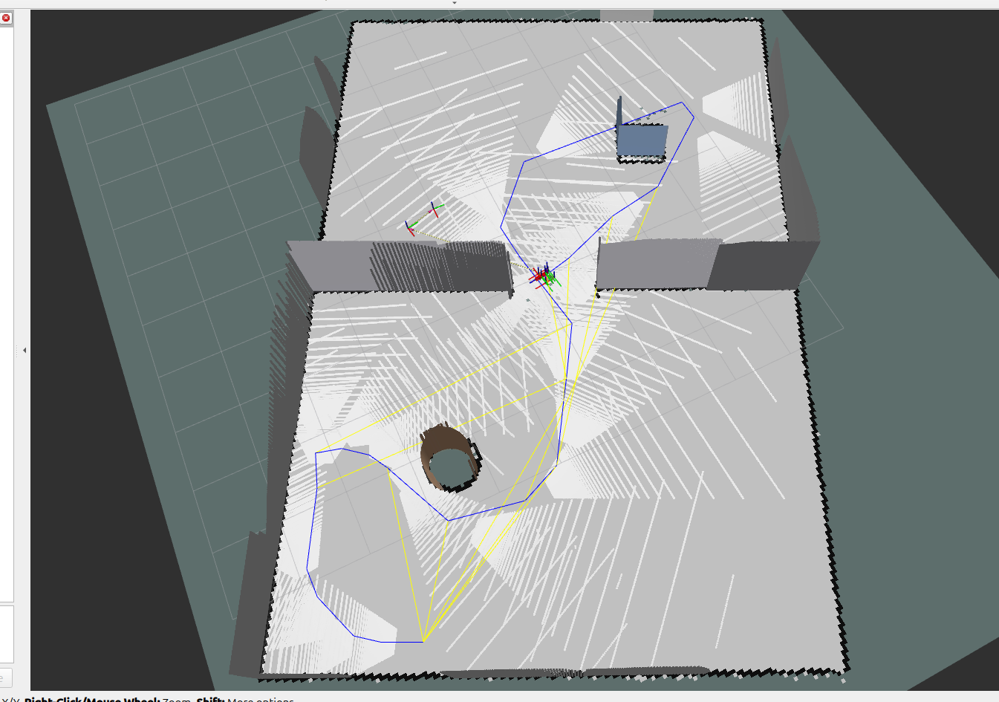

### Nav2 Point-to-Point Navigation

The following sequence shows Nav2 generating and updating the planned path while the robot moves through the mapped environment toward a user-defined goal.

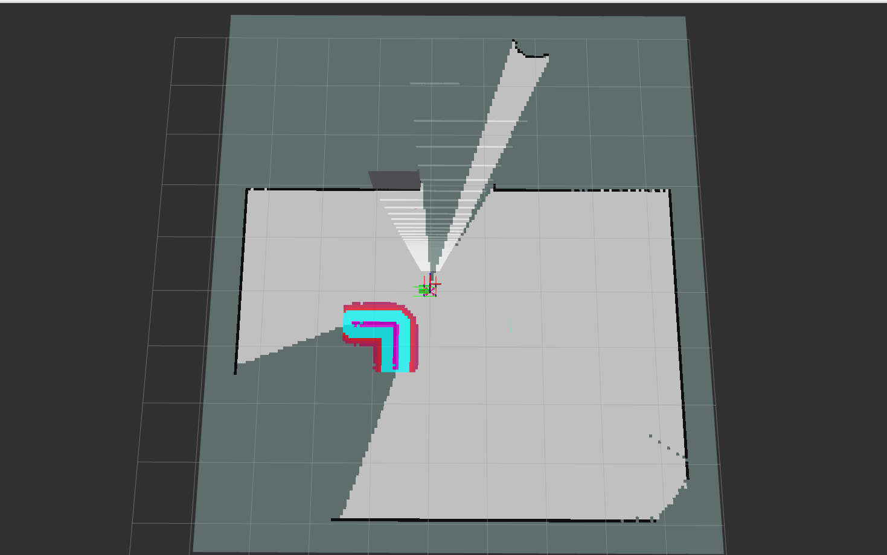

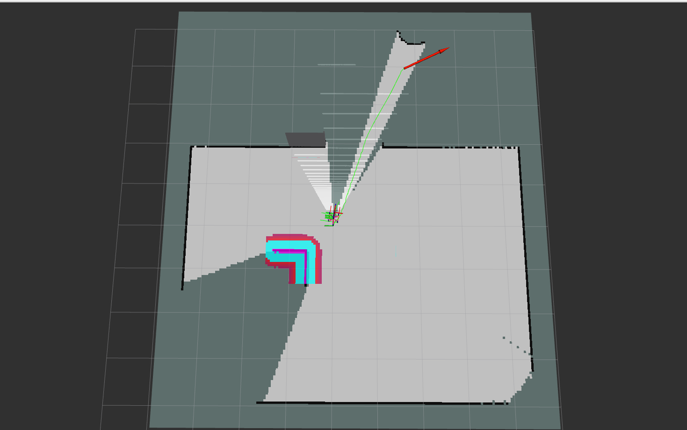

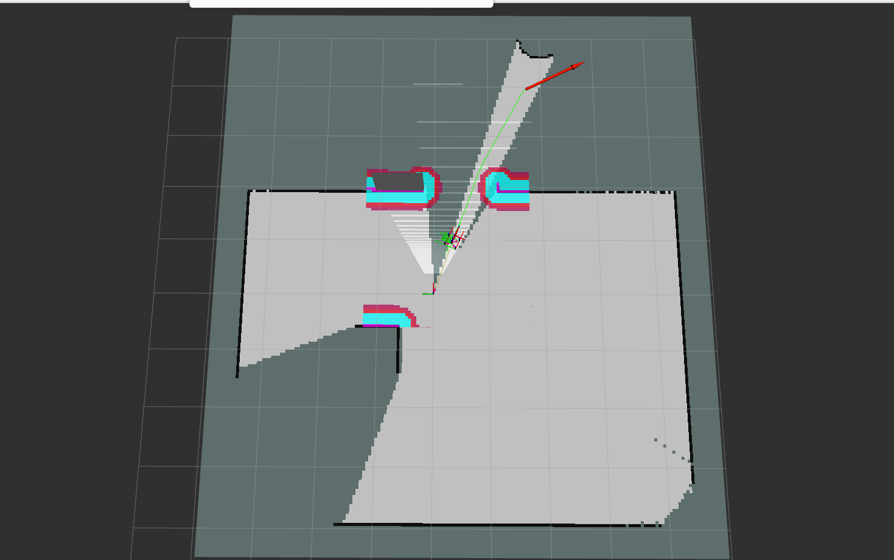

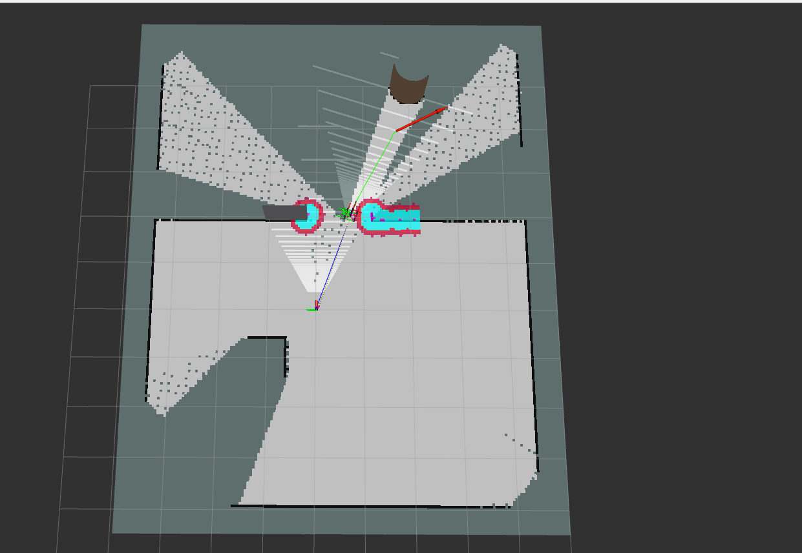

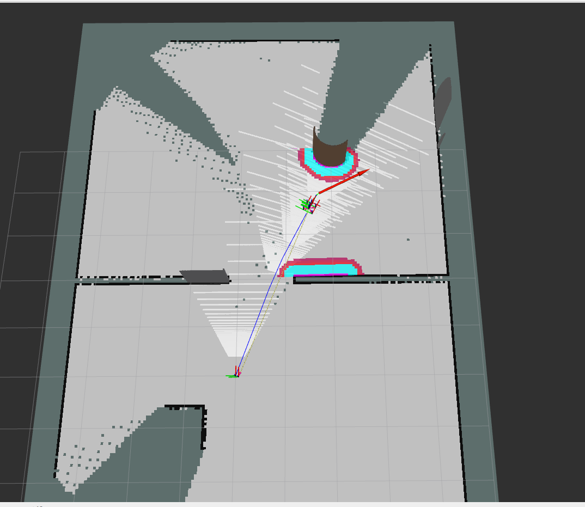

The sequence demonstrates global path planning, obstacle-aware local navigation, and path updates as the robot progresses through the environment.

### Autonomous Exploration with Explore Lite

After validating point-to-point navigation, Explore Lite was used to detect unexplored frontier regions and automatically send navigation goals to Nav2.

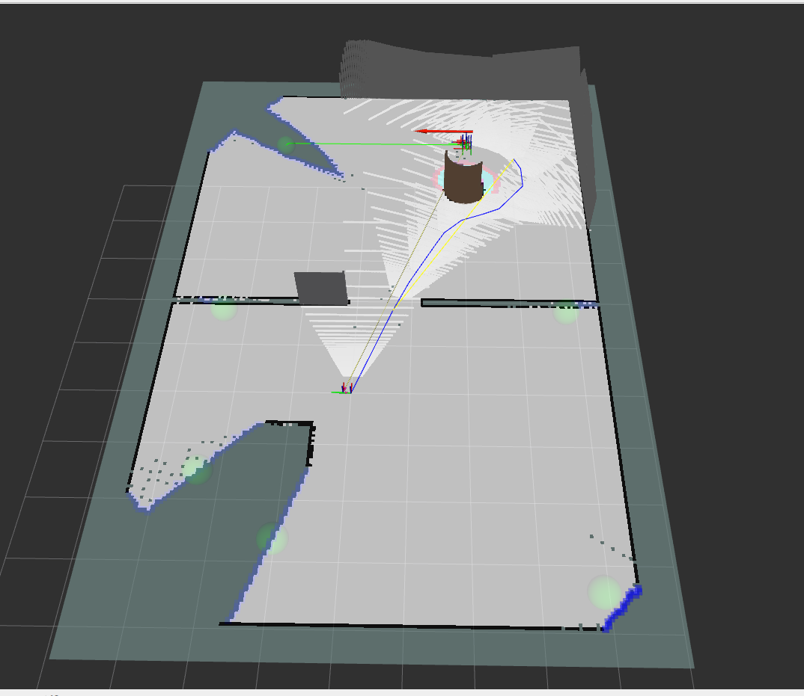

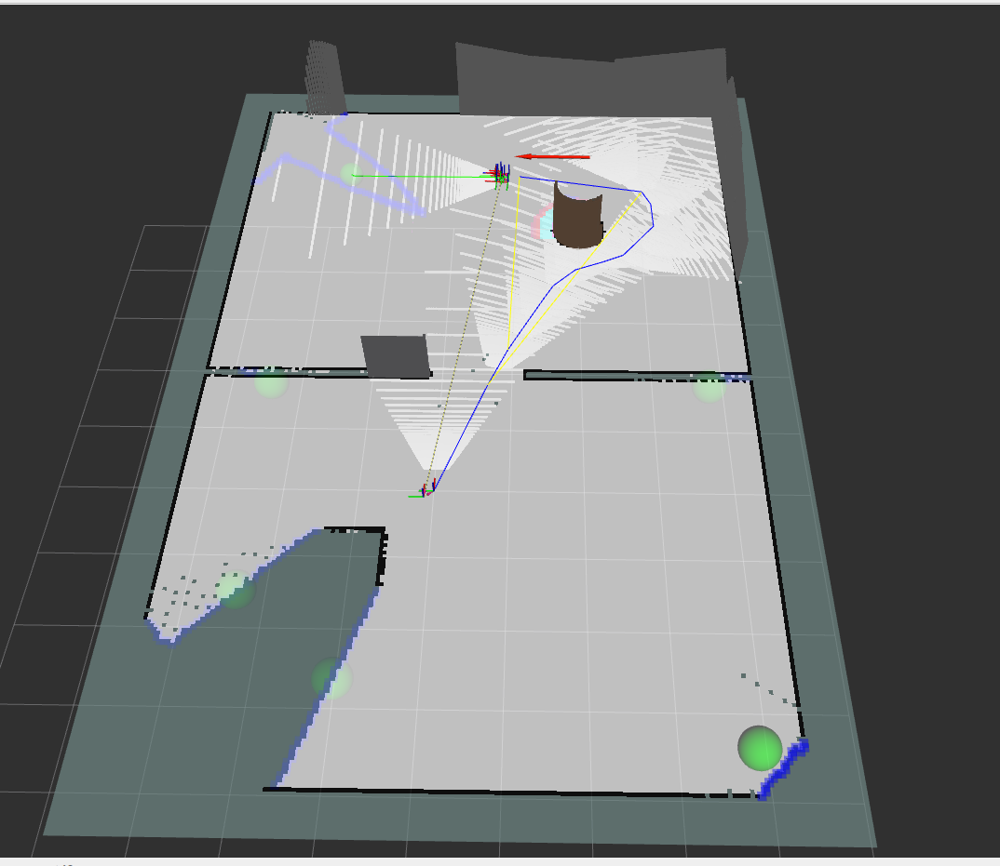

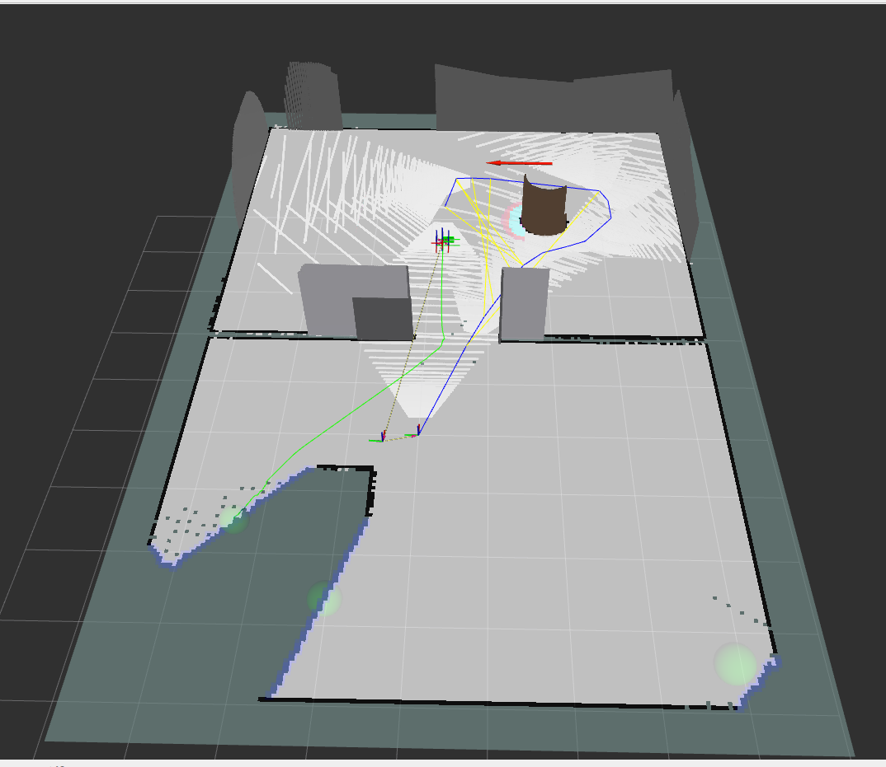

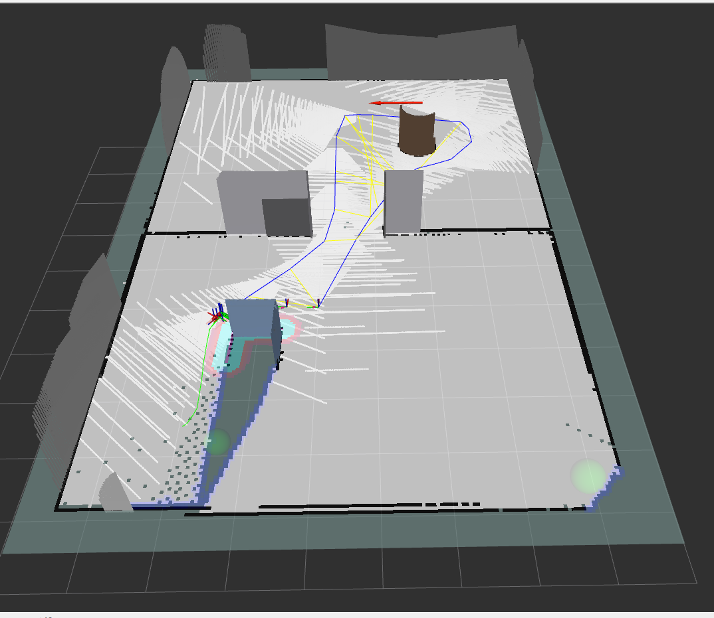

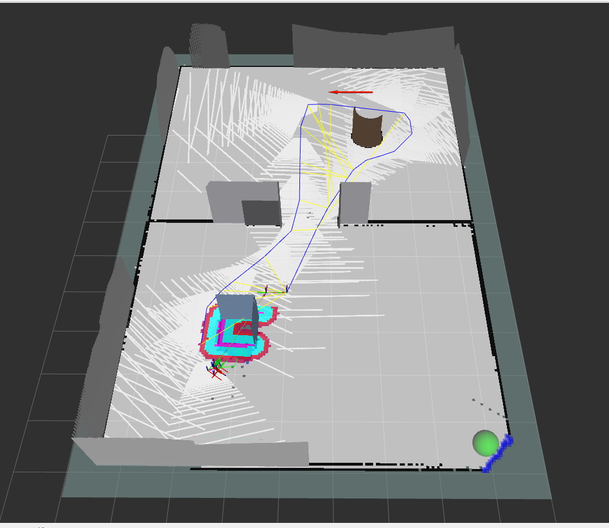

The sequence shows autonomous frontier-based exploration as the robot selects successive unexplored regions, navigates toward them using Nav2, and expands the mapped environment.
